# 前言

`阴阳师` `萌新` `套路` `攻略` `长生殿`

> 本攻略由体验服- **长生殿** 阴阳寮出品

> 主要针对刚入寮的小盆友们的一些常见问题及各种套路作出集中整理

> 减少大佬们多次反复解答造成不必要的困扰，望仔细阅读

## 编撰
- 主笔：**归一**、**典之澜roi**、**中二少女**
- 审校：**寮内全体成员**
- 开发：[战熊](https://github.com/yanzuo1992)

## 版本

- `1.0.0` 2017-2-11

## 敬告萌新
保肝养肝身体好，用眼适度保健康，  
苟利国家生死已，岂因福祸避趋之。

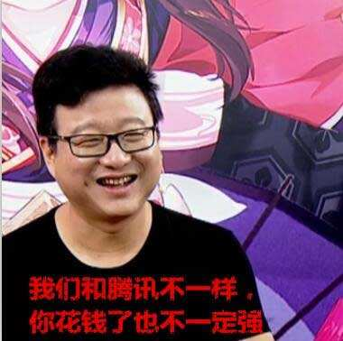

# 攻击类式神御魂搭配

## 综述
> **【必看！！！】**

> **SSR：茨木，狗子，酒吞，妖刀，荒川，灯姐**

> **SR：鸟，白狼，吸血姬，小黑，黑、白童子，脸狐，蜘蛛，夜叉，傀儡师，红叶，烟烟罗，犬神，海坊主，判官等。**

> **`多段攻击（群）`前期 `4针女+2暴击/2攻击套`（2号位速度/攻击，推荐攻击，4号位攻击，6号位暴击），后期`4针女+2攻击套`（6号暴击）**  

> **特别注明：萌新没有6号位暴击时，可以暂时选用`4针女+2暴击套`（6号位攻击），或者`4针女+2攻击套`（6号位暴击）**

>  **`单体爆发` 带 `4破势/网切/心眼+2暴击套`**  

>  **`反击流`带`4峥+2暴击套`**  

>  **所有攻击类御魂`2号主攻击/速度`，`4号攻击加成`，`6号暴击/暴伤`。**  

>  **御魂主属性一样副属性不同时，优先选择有`攻击`，`暴击`，`暴击伤害`，`速度`的。**  

>  **`暴击`很重要！（划重点）高攻击+高暴击+暴伤可以打出可观的伤害**  

>  **`6号位御魂`推荐`暴击>暴伤>攻击`。如果没有正常暴击6号位，可先用辅助类暴击。（有总比没有好）**

## SSR

> **SSR：茨木童子，大天狗，酒吞童子，妖刀姬，荒川之主**

### 茨木童子 <small>（茨木爸爸/一拳超人/猜拳童子）</small> <small><small><small>`单体攻击`</small></small></small>

>十分强大的妖怪，一只手臂被鬼切砍下。
一直追逐着酒吞童子。
对他来说，酒吞童子既是唯一的友人，
也是他心目中最欣赏的男人。
但酒吞童子却对他的示好毫不在意，
不知他何时才能再次和酒吞童子一起，
在那森林中，对酒当歌，如同往昔。

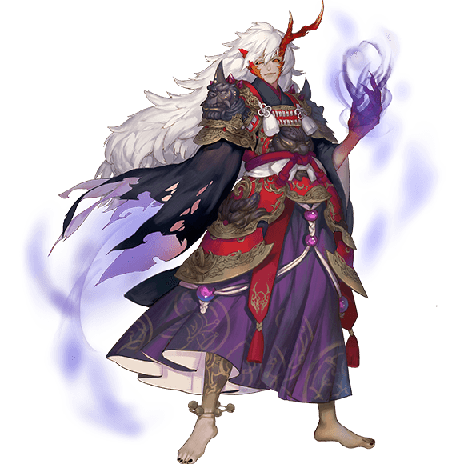

#### 御魂搭配

- 通用4破势+2暴击套 （2号攻击，4号攻击，6号没钱的暴击，有钱的暴伤）  

?> 注意破势吃血量多的 所以最好速度快 拿先手打。

- 极少多茨木情况下 4心眼+2暴击套 （2号攻击，4号攻击，6号没钱的暴击，有钱的暴伤）  

?> 注意此类是龟速茨木 专业收尾。

- 副属性优先级：`暴击>暴伤/速度>攻击加成`

!> **注意：** 茨木吃暴击和暴伤，所以养茨木很费钱！6星茨木和5星是天差地别，御魂一样，所以玩茨木的土豪推荐给茨木升6星，6号位6星暴击或暴伤。  
         `暴击流`：暴击101%为满暴，暴伤至少要堆个180%吧。  
         `暴伤流`：暴击率一般只有一半左右，暴伤250%-300%+。  
         成为一拳超人或猜拳童子请根据个人喜好和能力来玩
#### 式神搭配

- 暴击不够情况下，携带（N卡）`天邪鬼黄`，`灯笼鬼`，可以加暴击。

?> **速度一定要比茨木快！**。

- 斗技中常用套路，携带（N卡）`天邪鬼赤`拍屁股+`晴明`灭/缚+`茨木`地狱之手

?> 挑一个你觉得对面最弱的打，**如果对面触发镜姬，茨木GG**

### 妖刀姬 <small>（刀妹/胖次姬）</small> <small><small><small>`单体攻击`</small></small></small>

> 手持巨大妖刀的少女。
原本是人类，却不知为何与妖刀相互依存。
平时看上去有些阴郁，也很少会和他人说话。
但战斗时却会变成另一个人，残暴又恋战，
没有人能躲下她的妖刀，刀下亡魂累累，
平静下来后，她又会因伤害了太多人而自责。
有时候“强大”并不是一件好事，
必须有承受和控制这份“强大”的能力才行。

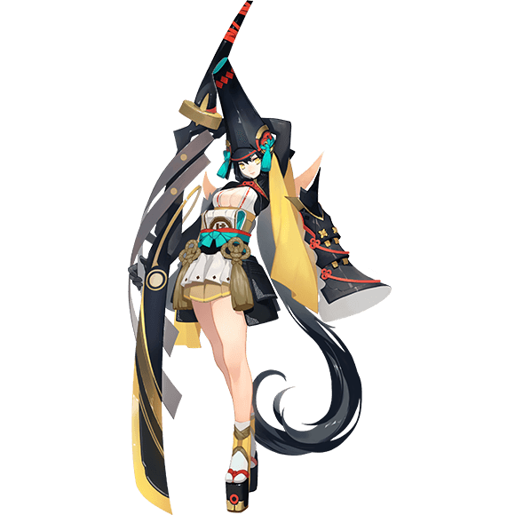

#### 御魂搭配

- 通用 4针女+2暴击套/攻击套 （2号攻击，4号攻击，6号暴击/暴伤 其他副属性能堆满暴的可以换暴伤）

- 散搭 3套暴击/2暴击+2暴击+2攻击（2号攻击，4号攻击，6号暴击/暴伤 其他副属性能堆满暴的可以换暴伤）  

- 副属性优先级：`暴击>暴伤>速度>攻击加成`

!> **注意：** 妹单体攻击最强，前期可能打不出来多少伤害，6星后+6星御魂可以一刀一个小朋友。另外刷御魂本注意控制刀妹速度，尾速出场收割最稳
#### 式神搭配

- 和`姑获鸟`很配，鸟姐放完大后刀妹收尾~

?> 一首**刀剑如梦**献给大家。

### 酒吞童子 <small>（葫芦娃）</small> <small><small><small>`单体攻击`</small></small></small>

> 传说中站在鬼族顶点的妖怪。
曾经冷静而残酷，具有王者风范。
但现在却整日借酒消愁，
除了酒，再也没有什么能够引起他的兴趣。
他所钟情的红叶也对他毫无好感，
不过逃避终究会有结束的一天，
昔日的酒吞童子总会归来。

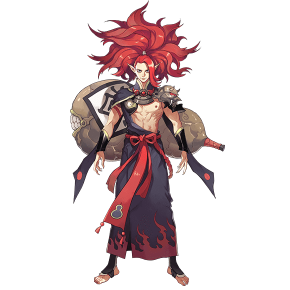

#### 御魂搭配

- 通用 4地藏/轮入道/峥+2攻击/暴击/生命（2号攻击，4号攻击，6号攻击/暴击）

- 副属性优先级：（并没有酒吞，归一补充一下~）

?> 看来寮里大佬们也在向着月见黑前进。。。

!> **注意：** 酒吞就是吐吐吐喝喝喝，主堆生命攻击，打不死的存在，6星后强无敌（**叫爸爸**）

#### 式神搭配

- 搭`惠比寿`（爷爷稳定奶）叠酒气又不死，带`狰`的可以搭`椒图`，反击流。配合`兵俑`可以安逸输出。

?> “**老爷子，再给我打一壶二锅头。**”

### 荒川之主 <small>（咸鱼王/老咸鱼）</small> <small><small><small>`单体攻击`</small></small></small>

> 远在东方的荒川的守护者与主宰者。
经历过岁月变迁、沧海桑田，
荒川流域一直平静而繁荣。
虽然他是个专制的暴君，
却不得不承认他的实力足以称王。
他却很少有笑容，也许无上的权力带给他的，
并不是快乐。

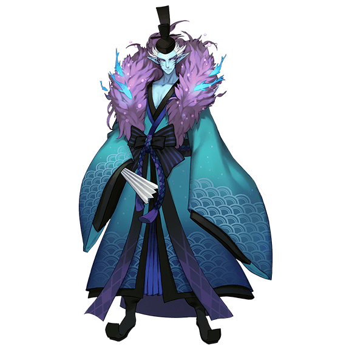

#### 御魂搭配

- 日常用 4网切/破势+2暴击套（2号攻击，4号攻击，6号暴击/暴伤 其他副属性能堆满暴的可以换暴伤）

?> 归一注：咸鱼不常用，御魂 **应该（可能/大概/差不多）** 是这样搭的（**吧**）。。。

!> **注意：** 荒川一般玩的人少，不推荐养，暴击堆高单体较强，可以秒一个人，有兴趣的可以玩

#### 式神搭配

- 可带一个场控，`雪女`或者`兵勇` 然后一个一个秒。。

?> “**吾！翻手为云，覆手为雨！欸？我扇子呢？**”

### 大天狗 <small>（大狗子）</small> <small><small><small>`群体攻击`</small></small></small>

> 面容清秀，背上长有翅膀的大天狗。
擅长吹奏笛子，他的笛声能使人心情平静。
性格固执而冷傲，
因此也很容易被人利用、误入歧途。
但实际上是个很有原则、也非常正直的妖怪。
一旦认定了自己的主人，就会十分忠心。

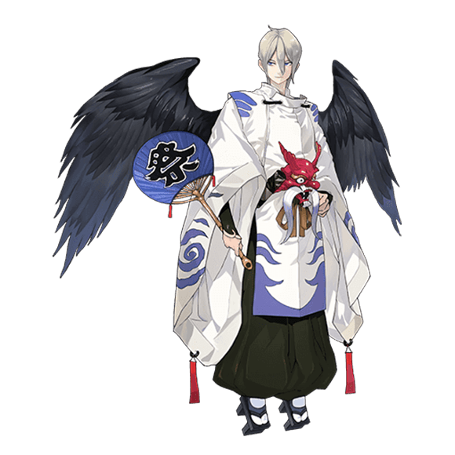

#### 御魂搭配

- 通用 4针女+2暴击套/攻击套 （2号攻击，4号攻击，6号暴击/暴伤 其他副属性能堆满暴的可以换暴伤）

?> 狗子是`多段攻击`所以**针女**优先搭配

- 斗技恶心人用 4魅妖/魍魉/雪幽魂+2蚌精/火灵（效果命中）（2号速度，4号效果命中，6号除防御外随意）

- 副属性优先级：攻击路线（`暴击>速度>暴伤>攻击加成`）；控制路线（`效果命中>速度>生命加成`）

!> **注意：** 狗子非常容易卷不死人，所以御魂最好高暴击，高攻击，高暴伤。要给狗子升6星带6星魂哦~

#### 式神搭配

- 听说狗子和`二突砸`很配 **(*/ω＼*)**。

?> **杰少：**“二突砸一般人都不用练，因为是个单体输出，前期不能带狗粮，后期输出又不稳，**如果你觉得自己脸好就练吧**- -”   
 **竹子：**“欧皇才玩”。  

### 青行灯 <small>（灯姐/不是青灯行，不是青灯行，不是青灯行！）</small> <small><small><small>`群体攻击`/`控制`</small></small></small>

> 掌灯的女子，面容清丽。
她最喜欢听怪谈故事、
也喜欢说怪谈故事给别人听。
她说的故事都十分有趣，绘声绘色。
但是可不要听入迷了哦，
如果一不小心连着听了一百个故事的话……
不知道会发生什么事情呢。

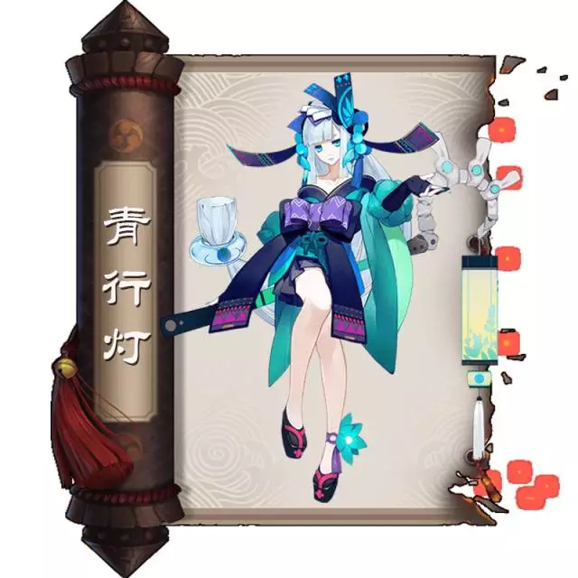

#### 御魂搭配

- 暴力攻击灯 4破势+2暴击套/攻击套（2号攻击，4号攻击，6号暴击/暴伤）

?>灯攻击面板低，可考虑带攻击二件套，6号推荐暴伤，副属性堆暴击

- 半控吸火灯 4轮入道+2暴击套（2号攻击，4号攻击，6号暴击/暴伤）

- 反击吸火灯 4狰+2暴击套（2号攻击，4号攻击，6号暴击/暴伤）

- 副属性优先级：`暴击>暴伤>速度/攻击加成`

!> **注意：** 灯姐虽然攻击面板只有B，但是大招158%的倍率是单段群攻中最高的。
            大招是对面每个式神30%概率吸火，所以平均能吸个2-3火，脸好可以吸到对面陷入只能普攻的窘境。
            重点是，美！啊！（归一你个痴汉！）

#### 式神搭配

- 斗技中可作为第二输出，搭配一个主输出使用；如果只有灯一个输出，那么队友要带强控带奶，保证生存能力。

?> 梦想闪亮亮，眼睛闭上，许下一个愿望，让灯姐带你飞翔

### 敬请期待...

## SR

### 姑获鸟 <small>（姑姑/鸟姐/狗粮队长）</small> <small><small><small>`群体攻击`</small></small></small>

> 手持纸伞的姑获鸟，最喜欢小婴儿。
一听到婴儿的哭声，她便会关切地赶过去。
有时候也会主动去照顾没有人照顾的孩子。
但也常常被人们误解。
其实她也是很善良的妖怪，只是选择的方式，
可能有些太强硬了呢？

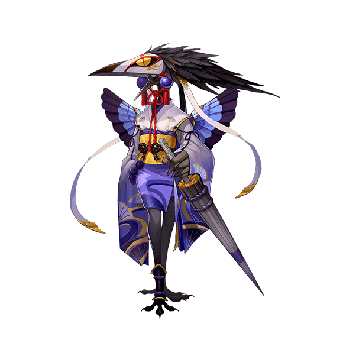

#### 御魂搭配

- 通用：4针女+2暴击/攻击（2号攻击，4号攻击，6号暴击/暴伤 其他副属性能堆满暴的可以换暴伤）

- 斗技恶心人用：4魅妖/魍魉/雪幽魂+2蚌精/火灵（效果命中）（2号速度，4号效果命中，6号除防御外随意）

- 副属性优先级：攻击路线（`暴击>速度>暴伤>攻击加成`）；控制路线（`效果命中>速度>生命加成`）   

!> **注意：** 鸟姐是SR中的**SSR**，获取方式简单可抽可砸可求碎片，推荐人手一只。鸟姐俗称狗粮队长，萌新可以养一只鸟姐带大所有式神~6星鸟姐+6星御魂很强~可以秒天秒地，6号主推暴击，暴伤堆副属性，够用就好  

#### 式神搭配

- 谁都能搭！

?> 来，宝宝不哭。姑姑给你糖吃。长不高？没关系。姑姑带你起飞！

### 白狼 <small>（狼姐）</small> <small><small><small>`单体攻击`</small></small></small>

> 学习弓术的狼族少女。
曾经是晴明的式神，但后来选择了离开。
与源博雅也有过不解之缘。
同为弓箭手，一直很欣赏博雅的弓术。
但也为自己迟迟不进步的弓术而苦恼……
最后终于找到了原因。

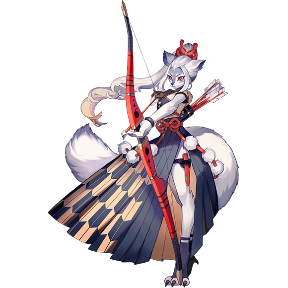

#### 御魂搭配

- 通用：4网切/破势/心眼+2暴击套（2号攻击，4号攻击，6号暴击/暴伤 其他副属性能堆满暴的可以换暴伤）

- 副属性优先级：`暴击>暴伤>速度>攻击加成`

!> **注意：** 白狼觉醒后70就满暴啦，所以副属性暴击堆够后可以6号位主暴伤，一箭一个小朋友。最推荐4破势+2暴击，六号暴伤，副属性暴击堆到50多就基本能用了

#### 式神搭配

- 可随意搭配，白狼高伤害但是比较脆，最好带奶哦！

?> 白狼对源博雅说不清，源博雅又是妹控，偏偏神乐失忆又黏晴明黏的紧，晴明又是白狼的御主而且也失忆了。。。

### 吸血姬 <small>卖血大佬</small> <small><small><small>`单体攻击`</small></small></small>

> 面容苍白，背后长有蝙蝠翅膀的少女。
曾经有幸福的家庭和爱护她的父母。
但却在某一天突然失去了这一切。
以血为食的她，难道不会感到害怕吗？
或者恶心，又或者是已经麻木了？
不知道是得到过又失去了比较不幸，
还是从一开始就没有得到过比较不幸呢。

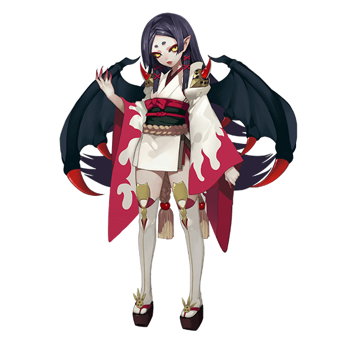

#### 御魂搭配

- 通用：4峥+2攻击/暴击套 （2号攻击，4号攻击，6号暴击/暴伤/攻击）

?> 后期斗技控制多，五星六星吸血姬四号位可考虑换效果抵抗，因为被控住就不能反击了

- 土豪专用：4骰子鬼+2抵抗/攻击/暴击套 （2号攻击，4号抵抗，6号暴击/暴伤/攻击）

?> `骰子鬼`是抵抗后反击，所以针对雨火等控制，后期斗技如果感到被控到不能自理，可以考虑收一套骰子鬼吸血姬，但是成本较高

- 副属性优先级：`效果抵抗>暴击>生命加成>暴伤>攻击加成`（中二个人看法）

!> **注意：** 吸血姬是卖血大佬，技能普攻比大招厉害，要注意血量！

#### 式神搭配

- `椒图` 反击流（斗鸡常用）：此套路要需要注意，`吸血姬`血量越少，伤害越高，带大奶可能会打不出最大伤害哦（不要带`惠比寿`！）。如果带奶就带桃花，吸血姬放心普攻坐等复活~阴阳师带神乐，技能续命，持续2回合，续命的式神血量判定为0，续命吸血姬一挠一个翻盘神器~

?> 我大哥叫[保罗·韦斯利](http://baike.baidu.com/link?url=Mxk2hnbYJntKM7wAcrbS1dD-ZLRa5pGbIVNkhV93XQ2iuQUpdTTGmGRkdYE-OzvwRqSfOk-pqOtZEj017Qww-mxNomMVIQ4tHR_0JS1RVn23BuyJDH7MGLm4Q91vJWk59YiEos1eeFm0Ef90GuDe8K)。

### 鬼使黑 <small>（小黑）</small> <small><small><small>`群体攻击`</small></small></small>

> 冥界的引路人，鬼使兄弟中的哥哥。
身为哥哥，常常需要弟弟的监督和提醒。
虽然豪爽好战，但却敏锐冷静
却和性格完全相反的弟弟相处得很好。
除了对弟弟十分关爱和珍惜之外，
也随时做好了为弟弟牺牲一切的准备，
就算弟弟一直在无视和拒绝，他也毫不气馁。
这就是哥哥的爱与坚强呢。

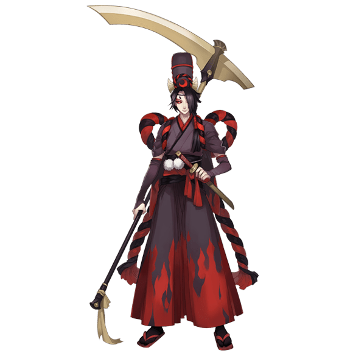

#### 御魂搭配

- 通用：4破势+2暴击/攻击套 （2号攻击/速度，4号攻击，6号暴击/暴伤/攻击）

?> 小黑可在妖气发现里面找队打 能很快凑齐~

- 副属性优先级：`暴击/暴伤>速度>攻击加成` **6号暴击就堆暴伤，6号暴伤就堆暴击**

!> **注意：** 在小小黑出来前小黑是收割机，一个大下去对面至少死一个然后再来一遍。副属性最好有加速度，抢先手~但也不可以太快

#### 式神搭配

- 带个速度比小黑快的丑女，插个稻草人。强力收割机。

?> 弟控就弟控，害羞什么。。。

### 黑童子 <small>（小小黑/卖血大佬）</small> <small><small><small>`群体攻击`</small></small></small>

> 还是孩童模样的鬼使，身着黑衣。
名为黑童子，性格孤僻沉默。
不善与人相处，但却很招小动物们的喜欢。
白童子是他唯一的朋友。
下决心无论发生什么，都要保护白童子。
哪怕要付出沉痛的代价。

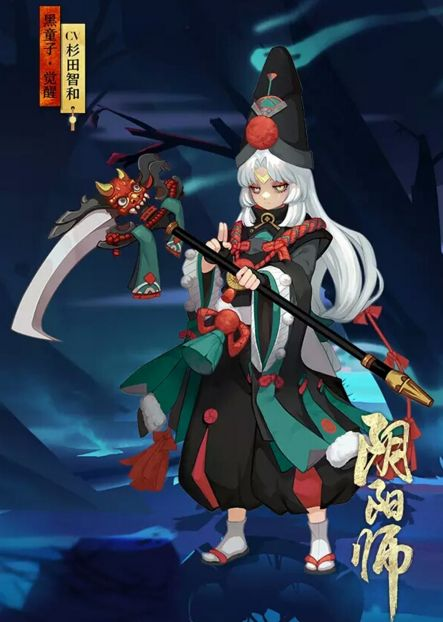

#### 御魂搭配

- 通用：4针女/心眼/破势+2暴击/攻击（2号攻击，4号攻击，6号暴击/暴伤 其他副属性能堆满暴的可以换暴伤）

?> 6号位的可以混搭，也可以混搭个生命。

- 斗技恶心人用：4魅妖/魍魉/雪幽魂/木魅+2蚌精/火灵 (2号攻击/生命，4号命中，6号攻击/生命，副属性带速度)

- 副属性优先级：`暴击>生命加成>暴伤>攻击加成` **小小黑很脆！看情况堆生命**

!> **注意：** 小小黑是强力反击流，血越少越厉害，连斩最多可触发4次，要控制血线哦

#### 式神搭配

- 斗鸡向：`椒图`+`小小黑` 只要小小黑不死不被控，就可以反杀全场。神乐续命，奶妈桃花，理由同吸血姬。

?> 实力搞基，要从娃娃抓起。

### 络新妇 <small>（蜘蛛）</small> <small><small><small>`群体攻击`</small></small></small>

> 领主大人贪图的，不过是我的美色而已。这一点，我比谁都清楚。  
我嫁给那庸俗的男人之日人群中却有另一个人用热切的目光看着我。  
就是这惊鸿一瞥，让我坠入了爱河。自从那天，我偷偷地开始和他见面  
可是我最后才发现，原来出卖我的人，就是他！    
男人就是这种东西，他们能想出来折磨人的招数，也不过如此  
他们将我扔进一个箱子里，想让黑暗和恐惧吞噬我  
在我适应了黑暗以后，我却看到了无数双狰狞的眼睛……密密麻麻，这黑暗的箱子里爬满了毒蜘蛛！整整一箱都是！  
他们蚕食了我的肉体……最后和我融为了一体  
从此，我们以男人为食，一个接一个地抓捕这些负心汉  

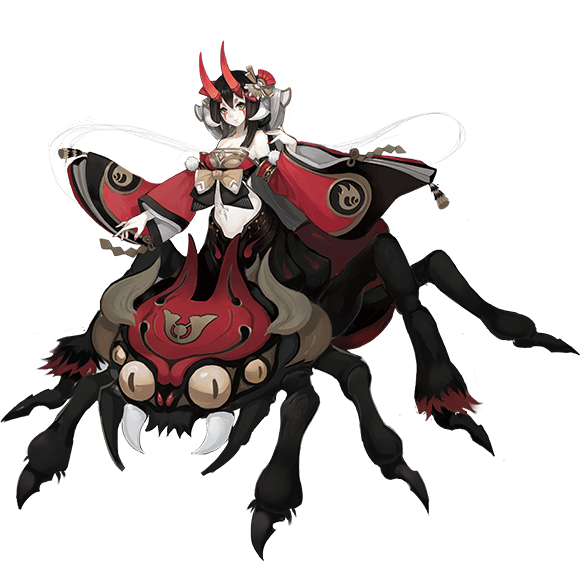

#### 御魂搭配

- 通用：4破势/心眼/网切/针女+2暴击套（2号攻击，4号攻击，6号暴击/暴伤 其他副属性能堆满暴的可以换暴伤）

?> 这个用的人较少 比较随意，带破势的速度要快起手放大。

- 副属性优先级：暂无

!> **注意：** 蜘蛛觉醒后初始攻击系数很高，大招伤害也很高，附带蜘蛛毒（不清楚什么毒，无所谓啦）喜欢的就养。新版本高速络新妇可以晕人，低速络新妇高攻击，所以看阵容选择高速还是低速路线

#### 式神搭配

- 只要速度快，上去就是干~

?> 络新妇的传记故事是所有式神故事中最让我毛骨悚然的一个。。战熊注。。

### 妖狐 <small>（二突子/小生/脸狐）</small> <small><small><small>`单体攻击`</small></small></small>

> 带着面具的男子狐妖，手持折扇。
自称'小生'，似乎十分风雅有礼。
爱好特长都很多，也喜欢交谈。
但是，真面目一般都和看上去不一样呢，
不管是人、还是妖怪。
还请多加小心。

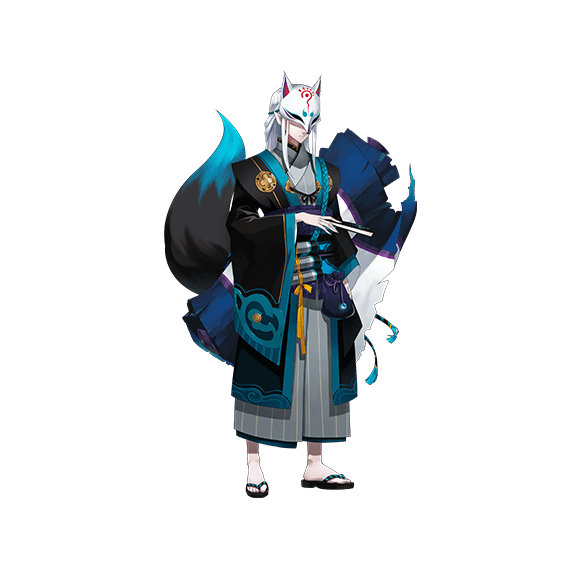

#### 御魂搭配

- 通用：4针女+2暴击套（2号攻击，4号攻击，6号暴击/暴伤 其他副属性能堆满暴的可以换暴伤）

- 副属性优先级：`暴击>暴伤>速度>攻击加成`

!> **注意：** 脸狐技能很看脸，有可能突2下也有可能突20下以上，所以升技能很重要~脸好也重要

#### 式神搭配

- 二突子和狗子是cp，其他无特殊要求

?> 老子当年一回合突突掉了一整只石距！

### 夜叉 <small>（狗子和脸狐的儿子）</small> <small><small><small>`单体攻击`</small></small></small>

> 名为夜叉的妖怪，喜杀戮。
会在固定的地方出没。
等厌倦了之后，就会换下一个地方。
一直是独来独往，没有朋友，也没有亲人。
或许因此才格外喜欢戏弄人类。
如果遇到他的话，千万要马上逃跑哦。

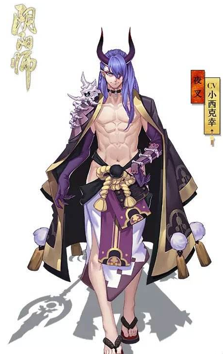

#### 御魂搭配

- 通用：4针女+2暴击套（2号攻击，4号攻击，6号暴击/暴伤 其他副属性能堆满暴的可以换暴伤）

- 副属性优先级：`暴击>暴伤>速度>攻击加成`

!> **注意：** 新型大帅比，和脸狐一样比较看脸，黄泉之海伤害较高，但是有可能只卷2下（恩，没错，确实帅比都得**看脸**）

#### 式神搭配

- 无特殊要求~火够就行

?> 老子穿的少，你们说我梅川内裤，老子穿上衣服，你们又说老子抄袭，想要闹哪样？

### 傀儡师 <small>（娘化的赤砂之蝎？）</small> <small><small><small>`单体攻击`</small></small></small>

> 沉默的少女，操纵着傀儡。
偶尔开口的时候几乎每句都会提到'哥哥'。
每当她喊'哥哥'的时候，
她身后的傀儡都会温柔地注视着她。
而她也常常温柔地注视着那只傀儡。
看来，每个人都有自己的故事和秘密呢。

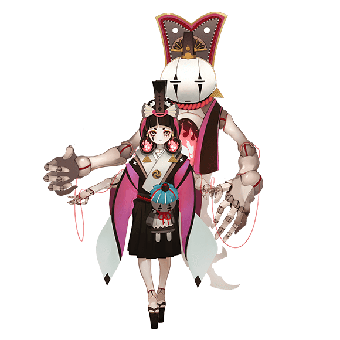

#### 御魂搭配

- 通用：4针女+2暴击套（2号攻击，4号攻击，6号暴击/暴伤 其他副属性能堆满暴的可以换暴伤）

- 副属性优先级：`暴击>暴伤>速度>攻击加成`

!> **注意：** 现版本增强，单体爆发伤害高

#### 式神搭配

- 无特殊要求~

?> 我十分想吐槽为何背景故事这么像赤砂之蝎？

### 鬼女红叶 <small>（无脑花痴）</small> <small><small><small>`群体攻击`</small></small></small>

> 红叶林中的绝色女鬼。
自从她第一次遇见晴明之后，
她的命运就变得完全不一样了。
她深爱着晴明，正如酒吞童子深爱着她。
但这两份感情终究都得不到回应，
也许深情本身就是一桩悲剧。

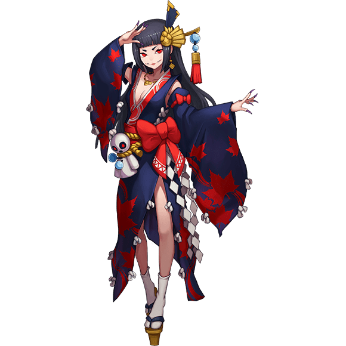

#### 御魂搭配

- 前期：可以2+2+2暴击套（2号攻击，4号攻击，6号暴击/暴伤 其他副属性能堆满暴的可以换暴伤）

- 后期：可以4破势+2暴击套（2号攻击，4号攻击，6号暴击/暴伤 其他副属性能堆满暴的可以换暴伤）

- 副属性优先级：`暴击>暴伤>速度>攻击加成`

!> **注意：** 红叶初始速度快，放了大后会有持续伤害，建议破势起手。6号暴伤，暴击两个就能保底，暴击三个以上就赚了~对面人多总会有暴击的（中二推荐）

#### 式神搭配

- `红叶`和`酒吞`是cp~和`清明`组队时头上会有心型气泡~

?> 又一个晴明惹得祸。。唉。。晴明啊晴明。。。

### 烟烟罗 <small>（长腿姐姐/烟烟）</small> <small><small><small>`单体攻击`/`群体攻击`</small></small></small>

> 名为烟烟罗的妖怪。
传闻是一位容姿妩媚的美人。
却极少有人见过她真正的样子。
她平日里都化作烟雾，
将自己藏匿在不起眼的地方，
暗中观察这世界上的每一个角落。

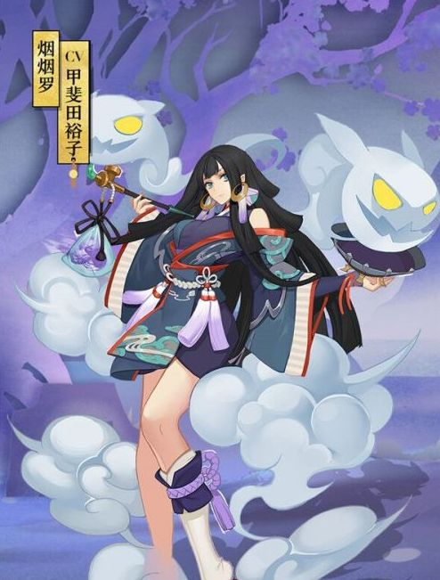

#### 御魂搭配

- 通用：4针女+2暴击套（2号攻击，4号攻击，6号暴击/暴伤 其他副属性能堆满暴的可以换暴伤）

- 副属性优先级：`暴击>暴伤>速度>攻击加成`

!> **注意：** 最新输出类美女，小鬼可以吃掉对方式神一回合，主要还是美。

#### 式神搭配

- 暂时无特殊要求

?> 美到冒烟说的就是烟烟~

### 犬神 <small>（狗神、柴犬、哈士奇）</small> <small><small><small>`群体攻击`</small></small></small>

> 性格正直勇敢而坚毅的妖怪，
为了情义可以赌上自己的性命。
成为式神之后，对自己的主人也十分忠诚。
但原本其实是袭击人类的恶犬，
却因挚友而彻底地改变了自己。
这个世界上最强的不是暴力，
而是那份信任友人的温柔。

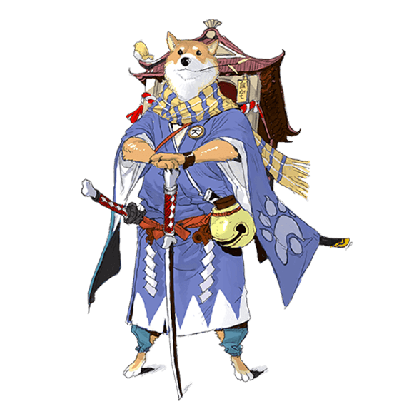

#### 御魂搭配

- 通用：4针女+2暴击套（2号攻击，4号攻击，6号暴击/暴伤 其他副属性能堆满暴的可以换暴伤）

- 斗技用：4峥+2暴击套（2号攻击，4号攻击，6号暴击/暴伤 其他副属性能堆满暴的可以换暴伤）

- 副属性优先级：`暴击>暴伤>攻击加成>速度`

!> **注意：** 犬神觉醒后增加守护技能带峥玩普攻的反击流可以

#### 式神搭配

- 斗技用：`椒`图+`犬神`，效果如同带吸血姬和小小黑一样，不同的是椒图涓流后无论哪个被打了都会触发守护效果。具体套路如下：`椒图`/拉条+`兵佣`+`蝴蝶``+犬神`+`打火机`，高速高命中兵佣先手嘲讽，对面打一下兵佣犬神反击一次，兵佣血量压低后蝴蝶可以不断超车奶。这个套路早期很多人用，现在用的人少了。

?> 犬神萌的不要不要的。。。

### 海坊主 <small>（鱼头）</small> <small><small><small>`群体攻击`/`治疗式神`</small></small></small>

> 鱼头人身的妖怪。
有鱼尾巴，以及长长的胡子。
如果有暴风雨来临的话，会去提醒船夫们。
但是总有人不相信他的劝告。
所以有时候，听听他人的劝诫也是很重要的，
说不定会有很大的帮助呢。

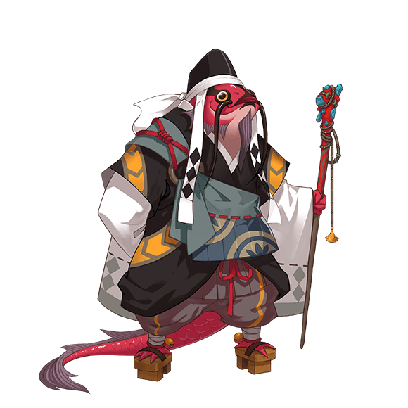

#### 御魂搭配

- 通用：4针女/峥+2暴击套（2号攻击，4号攻击，6号暴击/暴伤 其他副属性能堆满暴的可以换暴伤）

- 斗技：4魅妖/魍魉/雪幽魂+2攻击/蚌精/火灵 (2号攻击/生命，4号命中/攻击，6号攻击/生命，副属性带速度)

- 副属性优先级：攻击路线（`暴击>速度>暴伤>攻击加成`）；控制路线（`效果命中>速度>生命加成`）

!> **注意：** 其实斗技超好用，被虐过好几次，能抗能打能控能奶，奈何限于颜值问题。。强烈要求官方出皮肤！

#### 式神搭配

- 暂无

?> 我很丑，但我很温柔。

### 判官 <small>（瞎子）</small> <small><small><small>`群体攻击`</small></small></small>

> 掌管生死簿的判官。
一纸、一笔、一墨、一念之间即可定人生死。
因此他的性格也十分认真负责。
那份不苟言笑，似乎少了些人情味。
但在他那严肃的外表下，在他无私的心中，
或许意外地在思考什么令人发笑的事情呢。

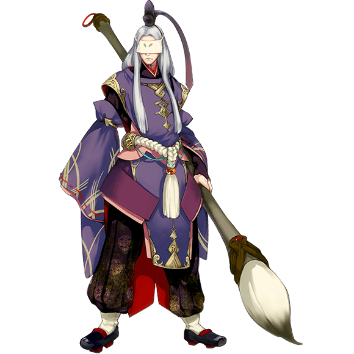

#### 御魂搭配

- 收割流：4心眼+2攻击（2号攻击，4号攻击，6号暴伤）

?> 判官被动满技后对30%血量以下式神必暴击，与心眼30%血量以下额外伤害50%正好匹配，所以可以舍弃暴击，直接堆暴伤，收割输出爆炸

- 稳定输出：攻击2*2*2/暴击套2*2*2/攻击2*2+2暴击/暴击2*2+2攻击（2号攻击，4号攻击，6号暴伤）

?> 心眼套前期输出太低，可换成2*2*2的搭配更快压血线

- 副属性优先级：`暴伤>攻击加成>速度/暴击`

!> **注意：** 冷门式神，当初因为他是我的唯一群攻就研究了一下，pve不能用，但是斗技走判火流可能有奇效

#### 式神搭配

- 斗技：可用判火流，判官的死字属于debuff，可以搭配高命中凤凰火，相比雨火可以多一个输出，但是对先手要求高。

?> 挥毫泼墨，大笔一挥：Hello world!

### 敬请期待...
【还有很多咸鱼，冷门类式神暂时懒得写了，欢迎补充。】
